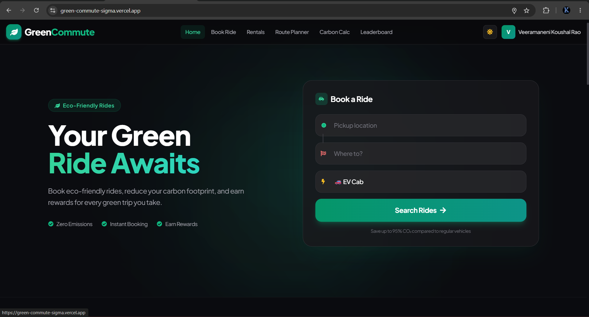
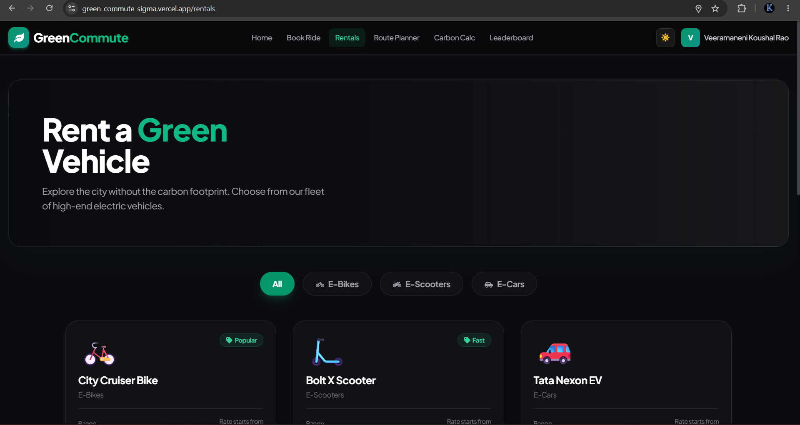
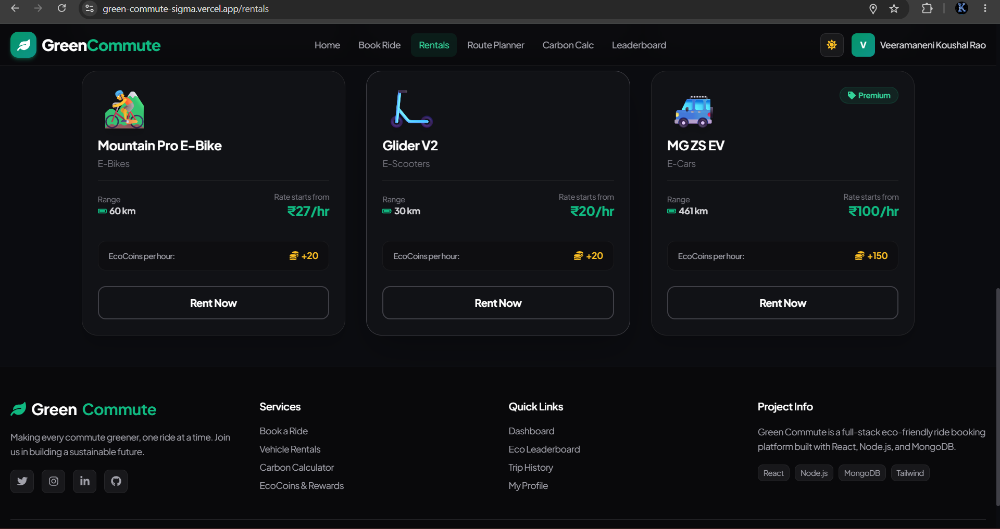
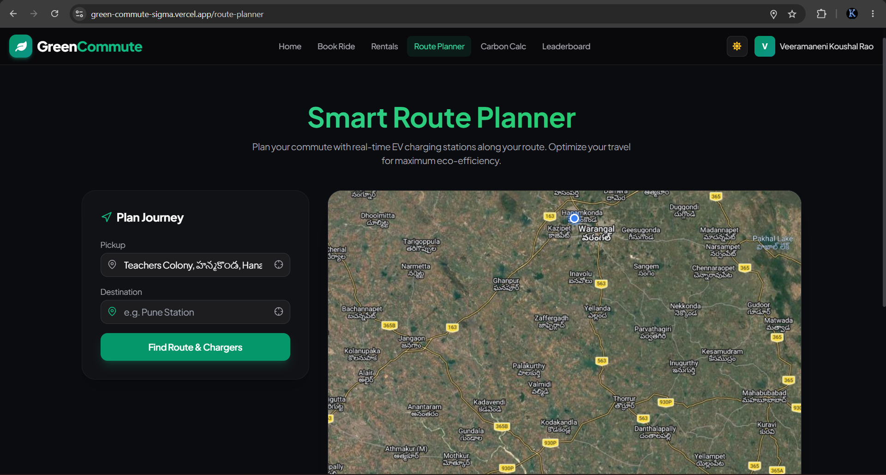
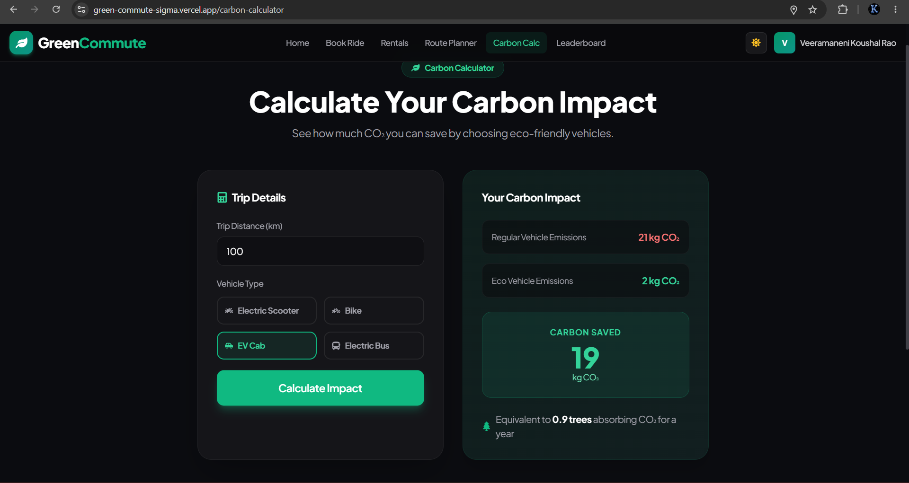
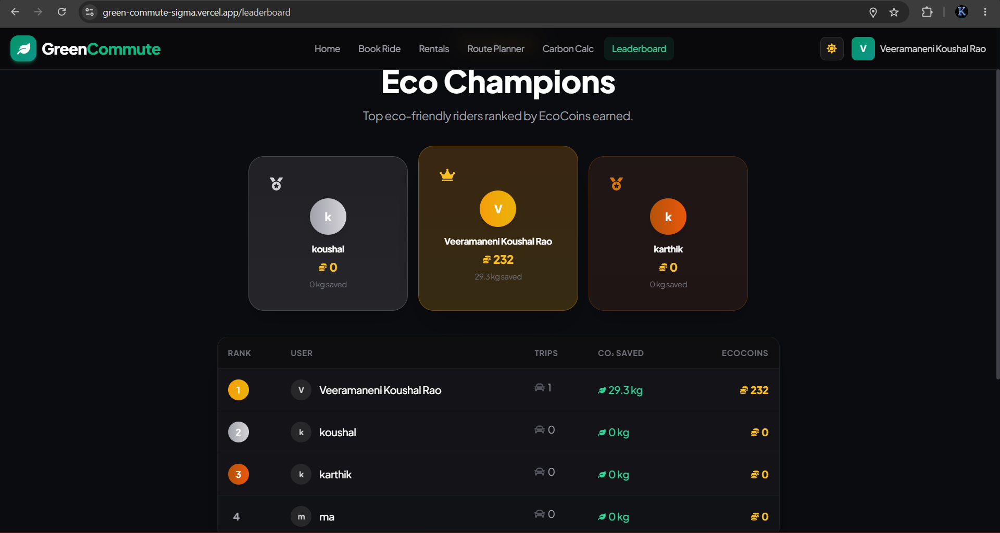

#  Green Commute

Green Commute is a full-stack eco-friendly transportation platform designed to promote sustainable mobility through electric vehicle rentals, ride booking, carbon footprint tracking, and reward-based gamification. The platform encourages users to make environmentally conscious travel choices while earning rewards for reducing carbon emissions.

 **Live Demo:** https://green-commute-sigma.vercel.app

---

##  Overview

Transportation contributes significantly to global carbon emissions. Green Commute provides users with a sustainable alternative by combining eco-friendly transportation services with environmental awareness tools.

The platform enables users to:

- Book eco-friendly rides
- Rent electric vehicles
- Plan optimized travel routes
- Calculate carbon emissions savings
- Earn EcoCoins for sustainable travel
- Compete on an environmental leaderboard

---

##  Features

###  Eco-Friendly Ride Booking
- Book sustainable transportation options
- Track ride history
- Earn EcoCoins for every ride
- View environmental impact

###  Electric Vehicle Rentals
- Rent E-Bikes
- Rent E-Scooters
- Rent EV Cars
- View vehicle range and pricing
- Earn EcoCoins through rentals

###  Smart Route Planner
- Interactive route planning
- Location search and navigation
- EV-friendly route optimization
- Integrated map visualization

###  Carbon Footprint Calculator
- Compare traditional vehicle emissions with EV emissions
- Calculate carbon savings
- View environmental impact metrics
- Promote sustainable decision-making

###  Eco Champions Leaderboard
- Compete with other users
- Rank based on EcoCoins earned
- Track carbon savings
- Encourage sustainable habits through gamification

###  Secure Authentication
- User Registration
- User Login
- JWT Authentication
- Protected Routes
- User Profile Management

###  EcoCoin Reward System
- Earn EcoCoins for eco-friendly actions
- Track sustainability progress
- Leaderboard integration
- Reward-based engagement

---

##  Screenshots

###  Home Page

The landing page provides users with access to ride booking and platform services.



---

###  Vehicle Rentals

Browse available electric vehicles and select suitable rental options.



---

###  Rental Fleet

Detailed rental listings displaying range, pricing, and EcoCoin rewards.



---

###  Smart Route Planner

Plan routes efficiently with map-based navigation support.



---

###  Carbon Footprint Calculator

Calculate CO₂ savings and compare eco-friendly transportation alternatives.



---

###  Eco Champions Leaderboard

View rankings based on EcoCoins earned and carbon emissions reduced.



---

##  System Architecture

```text
Frontend (React + Tailwind CSS)
          │
          ▼
Backend API (Node.js + Express.js)
          │
          ▼
MongoDB Atlas Database
          │
          ▼
Authentication & Business Logic
```

---

##  Tech Stack

### Frontend
- React.js
- Tailwind CSS
- React Router DOM
- Axios
- Lucide React
- Leaflet Maps

### Backend
- Node.js
- Express.js
- JWT Authentication
- Bcrypt.js
- Nodemailer

### Database
- MongoDB Atlas
- Mongoose

### Maps & Geolocation
- OpenStreetMap
- Leaflet.js
- Nominatim Geocoding API

### Deployment
- Vercel (Frontend)
- Render (Backend)
- MongoDB Atlas (Database)

---

##  Project Structure

```bash
Green-Commute
│
├── client
│   ├── public
│   ├── src
│   └── package.json
│
├── server
│   ├── controllers
│   ├── middleware
│   ├── models
│   ├── routes
│   ├── config
│   └── package.json
│
├── screenshots
│   ├── home.png
│   ├── rentals.png
│   ├── rentals2.png
│   ├── routeplanner.png
│   ├── carboncalc.png
│   └── leaderboard.png
│
└── README.md
```

---

##  Installation

### Clone Repository

```bash
git clone https://github.com/your-username/green-commute.git

cd green-commute
```

### Install Frontend Dependencies

```bash
cd client
npm install
```

### Install Backend Dependencies

```bash
cd ../server
npm install
```

---

##  Environment Variables

Create a `.env` file inside the server directory:

```env
PORT=5000

MONGO_URI=your_mongodb_connection_string

JWT_SECRET=your_jwt_secret

EMAIL_USER=your_email

EMAIL_PASS=your_email_password

CLIENT_URL=http://localhost:5173
```

---

##  Run Locally

### Start Backend

```bash
cd server
npm start
```

### Start Frontend

```bash
cd client
npm run dev
```

Application will be available at:

```text
Frontend: http://localhost:5173
Backend:  http://localhost:5000
```

---

##  API Endpoints

### Authentication

```http
POST /api/users/register
POST /api/users/login
GET  /api/users/profile
```

### Trips

```http
POST /api/trips/book
GET  /api/trips/history
GET  /api/trips/stats
```

### Rentals

```http
GET  /api/rentals
POST /api/rentals/book
```

### Carbon Calculator

```http
POST /api/carbon/calculate
```

---

##  Sustainability Impact

Green Commute promotes:

- Reduced carbon emissions
- Electric mobility adoption
- Sustainable transportation practices
- Environmental awareness
- Green commuting habits
- Carbon footprint reduction

---

##  Team Members

This project was collaboratively developed by a team of four students:

- Sumegh
- Mani
- Rakshitha
- Koushal Rao

---

##  Deployment

### Frontend

https://green-commute-sigma.vercel.app

### Backend

https://greencommute-api-p557.onrender.com

---

##  Future Enhancements

- Real-time ride booking integration
- Live EV charging station availability
- Google Maps Directions API integration
- EcoCoin redemption marketplace
- AI-powered route recommendations
- Mobile application support
- Ride-sharing and carpooling features
- Advanced sustainability analytics

---

##  Contributing

Contributions are welcome.

1. Fork the repository
2. Create a feature branch

```bash
git checkout -b feature-name
```

3. Commit your changes

```bash
git commit -m "Add new feature"
```

4. Push to GitHub

```bash
git push origin feature-name
```

5. Open a Pull Request

---

##  License

This project is developed for educational and demonstration purposes.

---

##  Building a Greener Future, One Ride at a Time

Green Commute empowers users to reduce their environmental impact through sustainable transportation choices while making eco-friendly commuting simple, rewarding, and accessible.
